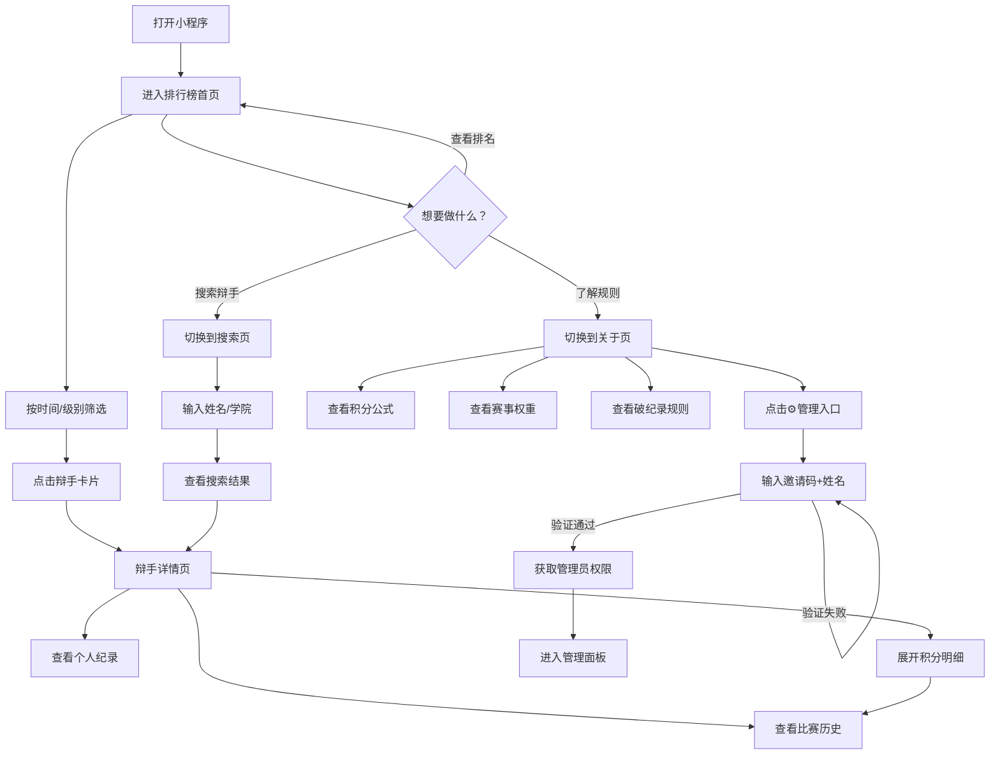
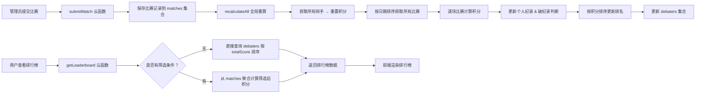
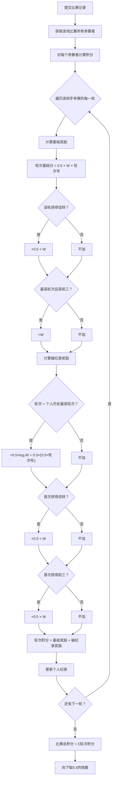

# 东华大学辩手积分榜 — 原型图与用户动线

## 一、全局导航结构

```
┌─────────────────────────────────────────┐
│           东华辩论积分榜（顶部导航栏）       │
├────────┬────────┬────────┬───────────────┤
│ 🏆 排行榜 │ 🔍 搜索  │ ℹ️ 关于  │  📝管理（隐藏入口） │
└────────┴────────┴────────┴───────────────┘
                  Tab Bar
```

---

## 二、页面原型图

### 2.1 排行榜页（首页）

```
┌─────────────────────────────────┐
│     东华辩论积分榜               │  ← 导航栏
├─────────────────────────────────┤
│  [ 全部 ] [ 2026年4月 ▾ ]       │  ← 时间筛选（第一行）
├─────────────────────────────────┤
│  [ 全部 ] [ 校赛 ] [ 市赛 ]     │  ← 赛事级别筛选（第二行）
├─────────────────────────────────┤
│                                 │
│  ┌───────────────────────────┐  │
│  │ 🥇  张三  012345678       │  │  ← 排名卡片
│  │     管理学院 · 5场比赛     │  │
│  │                    12.5分  │  │
│  └───────────────────────────┘  │
│  ┌───────────────────────────┐  │
│  │ 🥈  李四  012345679       │  │
│  │     服装学院 · 3场比赛     │  │
│  │                     8.0分  │  │
│  └───────────────────────────┘  │
│  ┌───────────────────────────┐  │
│  │ 🥉  王五  012345680       │  │
│  │     计算机学院 · 4场比赛   │  │
│  │                     6.5分  │  │
│  └───────────────────────────┘  │
│  ┌───────────────────────────┐  │
│  │  4  赵六  012345681       │  │  ← 4名及以后显示数字
│  │     信息学院 · 2场比赛     │  │
│  │                     4.0分  │  │
│  └───────────────────────────┘  │
│         ···上拉加载更多···        │
├─────────────────────────────────┤
│  🏆排行榜    🔍搜索    ℹ️关于    │  ← Tab Bar
└─────────────────────────────────┘
```

#### 月份选择面板（弹出层）

```
┌─────────────────────────────────┐
│           (半透明遮罩)            │
│   ┌─────────────────────────┐   │
│   │      选择月份             │   │
│   ├─────────────────────────┤   │
│   │  2026年4月    当月  [✓] │   │
│   │  2026年3月              │   │
│   │  2026年2月              │   │
│   │  2026年1月              │   │
│   │  ···                    │   │
│   └─────────────────────────┘   │
└─────────────────────────────────┘
```

---

### 2.2 搜索页

```
┌─────────────────────────────────┐
│     东华辩论积分榜               │
├─────────────────────────────────┤
│  🔍  搜索辩手姓名或学院      ✕   │  ← 搜索栏
├─────────────────────────────────┤
│                                 │
│  ┌───────────────────────────┐  │
│  │ 🥇  张三  012345678       │  │  ← 搜索结果
│  │     管理学院 · 5场比赛     │  │
│  │                    12.5分  │  │
│  └───────────────────────────┘  │
│  ┌───────────────────────────┐  │
│  │  7  张小明 012345690      │  │
│  │     计算机学院 · 2场比赛   │  │
│  │                     3.0分  │  │
│  └───────────────────────────┘  │
│                                 │
│  找到 2 位辩手                   │
│                                 │
├─────────────────────────────────┤
│  🏆排行榜    🔍搜索    ℹ️关于    │
└─────────────────────────────────┘
```

#### 未搜索时（最近搜索）

```
┌─────────────────────────────────┐
│  🔍  搜索辩手姓名或学院          │
├─────────────────────────────────┤
│                                 │
│  最近搜索              [清除]    │
│  ┌──────┐ ┌──────┐ ┌──────┐   │
│  │ 张三 │ │李四  │ │ 计算机│   │
│  └──────┘ └──────┘ └──────┘   │
│                                 │
├─────────────────────────────────┤
│  🏆排行榜    🔍搜索    ℹ️关于    │
└─────────────────────────────────┘
```

---

### 2.3 辩手详情页

```
┌─────────────────────────────────┐
│  ← 辩手详情                     │  ← 可返回
├─────────────────────────────────┤
│  ┌───────────────────────────┐  │
│  │ 🥇  张三      012345678   │  │  ← 个人资料卡
│  │     管理学院 · 2023级      │  │
│  │                   12.5分  │  │
│  └───────────────────────────┘  │
│                                 │
│  ┌─────┐  ┌─────┐  ┌─────┐    │
│  │  5  │  │  3  │  │  2  │    │  ← 数据概览
│  │比赛场次│ │最高轮次│ │佳辩次数│    │
│  └─────┘  └─────┘  └─────┘    │
│                                 │
│  ┌───────────────────────────┐  │
│  │ 个人纪录                   │  │
│  │                           │  │
│  │ [校赛] 最高第3轮  🏅佳辩   │  │
│  │ [市赛] 最高第2轮  🏆前三   │  │
│  └───────────────────────────┘  │
│                                 │
│  比赛历史                        │
│  ┌───────────────────────────┐  │
│  │ 2026镜月杯 [校赛][半决赛]  │  │  ← 比赛卡片（可展开）
│  │ 2026-04-05       +4.0    │  │
│  │ ─ ─ ─ ─ ─ ─ ─ ─ ─ ─ ─ │  │
│  │ 展开时显示：               │  │
│  │  第3轮: 基础3.0 破纪0.5   │  │
│  │  第2轮: 基础1.0           │  │
│  │  合计: 4.0                │  │
│  └───────────────────────────┘  │
│  ┌───────────────────────────┐  │
│  │ 2026新锐杯 [校赛][初赛]    │  │
│  │ 2026-03-15       +2.0    │  │
│  └───────────────────────────┘  │
└─────────────────────────────────┘
```

---

### 2.4 关于页（积分规则 + 管理入口）

```
┌─────────────────────────────────┐
│     东华辩论积分榜               │
├─────────────────────────────────┤
│  ┌───────────────────────────┐  │
│  │  东华大学辩手积分榜    ⚙️  │  │  ← ⚙️ = 管理入口
│  │  东华大学辩论协会           │  │
│  └───────────────────────────┘  │
│                                 │
│  ┌───────────────────────────┐  │
│  │ 积分规则                   │  │
│  │                           │  │
│  │ 计算公式                   │  │
│  │  轮次积分=基础奖励+破纪录   │  │
│  │  比赛总积分=Σ轮次积分       │  │
│  │                           │  │
│  │ 基础奖励                   │  │
│  │  · 轮次基础分=0.5×W×轮次号 │  │
│  │  · 最佳辩手=0.5×W         │  │
│  │  · 前三名=W               │  │
│  │                           │  │
│  │ 赛事权重 W                 │  │
│  │  [院赛] W=1               │  │
│  │  [校赛] W=2               │  │
│  │  [市赛] W=4               │  │
│  │                           │  │
│  │ 破纪录奖励                 │  │
│  │  当辩手首次达到个人历史     │  │
│  │  最高纪录时，可获额外奖励   │  │
│  └───────────────────────────┘  │
│                                 │
│  ┌───────────────────────────┐  │
│  │ 积分汇报                   │  │
│  │  比赛结束后3个工作日内      │  │
│  │  提交比赛信息至辩协         │  │
│  └───────────────────────────┘  │
│                                 │
│     东华大学辩论协会              │
│     2026年3月起试行              │
├─────────────────────────────────┤
│  🏆排行榜    🔍搜索    ℹ️关于    │
└─────────────────────────────────┘
```

#### 管理员入口弹窗

```
┌─────────────────────────────────┐
│           (半透明遮罩)            │
│   ┌─────────────────────────┐   │
│   │      管理员入口           │   │
│   │                         │   │
│   │  请输入邀请码和你的姓名    │   │
│   │  以获取管理权限（7天）    │   │
│   │                         │   │
│   │  ┌─────────────────┐    │   │
│   │  │ 输入邀请码       │    │   │
│   │  └─────────────────┘    │   │
│   │  ┌─────────────────┐    │   │
│   │  │ 输入你的姓名     │    │   │
│   │  └─────────────────┘    │   │
│   │                         │   │
│   │  [取消]      [确定]     │   │
│   └─────────────────────────┘   │
└─────────────────────────────────┘
```

---

### 2.5 管理仪表盘

```
┌─────────────────────────────────┐
│  ← 管理面板                     │
├─────────────────────────────────┤
│  ┌───────────────────────────┐  │
│  │  管理面板                   │  │
│  │  超级管理员                 │  │
│  └───────────────────────────┘  │
│                                 │
│  ┌──────────┐  ┌──────────┐    │
│  │   32     │  │   18     │    │  ← 数据概览
│  │   辩手    │  │   比赛    │    │
│  └──────────┘  └──────────┘    │
│                                 │
│  ┌───────────────────────────┐  │
│  │  ⚠️ 下次建议清空比赛数据    │  │
│  │     2026-09-01             │  │
│  └───────────────────────────┘  │
│                                 │
│  ┌───────────────────────────┐  │
│  │ 📝  录入比赛           › │  │
│  │     录入新的比赛结果        │  │
│  └───────────────────────────┘  │
│  ┌───────────────────────────┐  │
│  │ 📋  比赛记录           › │  │
│  │     查看、管理已录入的比赛   │  │
│  └───────────────────────────┘  │
│  ┌───────────────────────────┐  │
│  │ 👥  管理辩手           › │  │
│  │     添加、编辑辩手信息      │  │
│  └───────────────────────────┘  │
│  ┌───────────────────────────┐  │
│  │ 🔑  邀请管理           › │  │  ← 仅超级管理员可见
│  │     生成邀请码             │  │
│  └───────────────────────────┘  │
│  ┌───────────────────────────┐  │
│  │ 🔄  重算积分           › │  │
│  │     全量重新计算所有积分    │  │
│  └───────────────────────────┘  │
│  ┌───────────────────────────┐  │
│  │ 🗑️  清空比赛数据    ›     │  │  ← 红色危险操作
│  │     删除所有比赛并重置积分   │  │
│  └───────────────────────────┘  │
└─────────────────────────────────┘
```

---

### 2.6 比赛录入（4步表单）

#### 步骤1：比赛信息

```
┌─────────────────────────────────┐
│  ← 录入比赛                     │
├─────────────────────────────────┤
│  ● 比赛信息 ─── 选参赛者 ─── 详细 ─── 确认 │  ← 步骤条
├─────────────────────────────────┤
│                                 │
│  比赛名称                       │
│  ┌─────────────────────────┐    │
│  │ 2026镜月杯               │    │
│  └─────────────────────────┘    │
│  ┌─── 建议列表 ───────────┐    │  ← 聚焦时弹出
│  │ 2026镜月杯               │    │
│  │ 2026新锐杯               │    │
│  │ 2025新生杯               │    │
│  └─────────────────────────┘    │
│                                 │
│  赛事级别                       │
│  ┌────────┐┌────────┐┌────────┐│
│  │ 院赛   ││ 校赛   ││ 市赛   ││  ← 单选
│  │ W=1    ││ W=2 ✓ ││ W=4    ││
│  └────────┘└────────┘└────────┘│
│                                 │
│  比赛日期                       │
│  ┌─────────────────────────┐    │
│  │ 2026-04-05        ▾     │    │  ← 日期选择器
│  └─────────────────────────┘    │
│                                 │
│  赛程                           │
│  ┌────┐┌────┐┌────┐┌────┐┌──┐│
│  │初赛││小组││复赛││半决赛││决赛││  ← 单选
│  │    ││ 赛 ││    ││     ││ ✓ ││
│  └────┘└────┘└────┘└────┘└──┘│
│  ┌────┐                         │
│  │复活赛│                        │
│  └────┘                         │
│                                 │
│  轮次                           │
│  ┌──┐┌──┐┌──┐┌──┐┌──┐          │
│  │1 ││2 ││3 ││4 ││5 │          │  ← 单选
│  └──┘└──┘└──┘└──┘└──┘          │
│                                 │
│          [下一步 →]              │
└─────────────────────────────────┘
```

#### 步骤2：选择参赛者

```
┌─────────────────────────────────┐
│  ← 录入比赛                     │
├─────────────────────────────────┤
│  ○ 比赛信息 ● 选参赛者 ─── 详细 ─── 确认 │
├─────────────────────────────────┤
│  🔍 搜索辩手姓名或学院        ✕  │
│                                 │
│  已选 3 人                       │
│                                 │
│   A                             │
│  ┌─────────────────────────┐    │
│  │ ✓ 陈七   012345682      │    │  ← 已选（打勾）
│  │         计算机学院        │    │
│  └─────────────────────────┘    │
│                                 │
│   L                             │
│  ┌─────────────────────────┐    │
│  │ ✓ 李四   012345679      │    │  ← 已选
│  │         服装学院          │    │
│  └─────────────────────────┘    │
│  ┌─────────────────────────┐    │
│  │   刘八   012345683      │    │  ← 未选
│  │         机械学院          │    │
│  └─────────────────────────┘    │
│                                 │
│   Z                             │  ← 右侧字母索引
│  ┌─────────────────────────┐    │  A
│  │ ✓ 张三   012345678      │    │  L
│  │         管理学院          │    │  Z
│  └─────────────────────────┘    │
│                                 │
│  [← 上一步]      [下一步 →]      │
└─────────────────────────────────┘
```

#### 步骤3：参赛者详情

```
┌─────────────────────────────────┐
│  ← 录入比赛                     │
├─────────────────────────────────┤
│  ○ 比赛信息 ○ 选参赛者 ● 详细 ─── 确认 │
├─────────────────────────────────┤
│                                 │
│  ┌───────────────────────────┐  │
│  │ 陈七        012345682     │  │
│  │                           │  │
│  │ ☑ 最佳辩手                │  │  ← 复选框
│  │ ☐ 获得前三名（冠亚季军）    │  │  ← 复选框
│  └───────────────────────────┘  │
│                                 │
│  ┌───────────────────────────┐  │
│  │ 李四        012345679     │  │
│  │                           │  │
│  │ ☐ 最佳辩手                │  │
│  │ ☐ 获得前三名（冠亚季军）    │  │
│  └───────────────────────────┘  │
│                                 │
│  ┌───────────────────────────┐  │
│  │ 张三        012345678     │  │
│  │                           │  │
│  │ ☑ 最佳辩手                │  │
│  │ ☑ 获得前三名（冠亚季军）    │  │
│  └───────────────────────────┘  │
│                                 │
│  [← 上一步]      [下一步 →]      │
└─────────────────────────────────┘
```

#### 步骤4：确认提交

```
┌─────────────────────────────────┐
│  ← 录入比赛                     │
├─────────────────────────────────┤
│  ○ 比赛信息 ○ 选参赛者 ○ 详细 ● 确认 │
├─────────────────────────────────┤
│                                 │
│  确认比赛信息                    │
│  ─────────────────────────────  │
│  比赛名称      2026镜月杯        │
│  赛事级别      校赛 (W=2)        │
│  比赛日期      2026-04-05        │
│  赛程          半决赛             │
│  轮次          第4轮              │
│  参赛人数      3人                │
│                                 │
│  参赛者详情                      │
│  ┌───────────────────────────┐  │
│  │ 陈七  012345682           │  │
│  │ 佳辩                      │  │
│  ├───────────────────────────┤  │
│  │ 李四  012345679           │  │
│  ├───────────────────────────┤  │
│  │ 张三  012345678           │  │
│  │ 佳辩  🏆 前三名           │  │
│  └───────────────────────────┘  │
│                                 │
│  [← 上一步]    [确认提交]        │
└─────────────────────────────────┘
```

---

### 2.7 比赛记录管理

```
┌─────────────────────────────────┐
│  ← 比赛记录                     │
├─────────────────────────────────┤
│  🔍 按比赛名称搜索               │
├─────────────────────────────────┤
│                                 │
│  ┌───────────────────────────┐  │
│  │ 2026镜月杯   [校赛][半决赛]  │  │  ← 分组展示
│  │         2轮 · 6条记录  展开▼│  │
│  │                           │  │
│  │  ── 第4轮 ── 2026-04-05   │  │
│  │  │ 张三  佳辩 前三  +4.0 x│  │  ← 可删除个人
│  │  │ 陈七  佳辩       +3.0 x│  │
│  │  │ 李四            +2.0 x│  │
│  │        [删除整轮]          │  │  ← 删除此轮
│  │                           │  │
│  │  ── 第3轮 ── 2026-04-02   │  │
│  │  │ 张三  前三       +4.0 x│  │
│  │  │ 王五            +2.0 x│  │
│  │        [删除整轮]          │  │
│  └───────────────────────────┘  │
│                                 │
│  ┌───────────────────────────┐  │
│  │ 2026新锐杯   [校赛][初赛]    │
│  │         1轮 · 3条记录  展开▼│  │
│  └───────────────────────────┘  │
│                                 │
├─────────────────────────────────┤
│  [ 比赛记录 ]  [ 积分明细 ]      │  ← 底部切换Tab
└─────────────────────────────────┘
```

#### 积分明细 Tab

```
┌─────────────────────────────────┐
│  ← 比赛记录                     │
├─────────────────────────────────┤
│  [ 按时间 ]  [ 按辩手 ]          │  ← 排序切换
├─────────────────────────────────┤
│                                 │
│  ┌───────────────────────────┐  │
│  │ 张三  012345678           │  │
│  │ 2026镜月杯                 │  │
│  │ [校赛][半决赛][第4轮]      │  │
│  │ 2026-04-05          +4.0  │  │
│  │              [明细] [删除] │  │
│  │                           │  │
│  │  ┌─ 展开明细 ────────────┐│  │
│  │  │ 第4轮: 基础4.0        ││  │
│  │  │  佳辩奖励 +1.0        ││  │
│  │  │ 前三奖励 +2.0        ││  │
│  │  │ 轮次合计: 7.0         ││  │
│  │  └───────────────────────┘│  │
│  └───────────────────────────┘  │
│                                 │
├─────────────────────────────────┤
│  [ 比赛记录 ]  [ 积分明细 ]      │
└─────────────────────────────────┘
```

---

### 2.8 辩手管理

```
┌─────────────────────────────────┐
│  ← 辩手管理                     │
├─────────────────────────────────┤
│  [+ 添加辩手]    [学院管理]      │  ← 操作按钮
├─────────────────────────────────┤
│                                 │
│  ┌───────────────────────────┐  │
│  │ 张三  012345678           │  │
│  │ 管理学院·2023级·12.5分    │  │
│  │              [编辑] [删除] │  │
│  └───────────────────────────┘  │
│  ┌───────────────────────────┐  │
│  │ 李四  012345679           │  │
│  │ 服装学院·2023级·8.0分     │  │
│  │              [编辑] [删除] │  │
│  └───────────────────────────┘  │
│  ┌───────────────────────────┐  │
│  │ 王五  012345680           │  │
│  │ 计算机学院·2024级·6.5分   │  │
│  │              [编辑] [删除] │  │
│  └───────────────────────────┘  │
│         ···                    │
└─────────────────────────────────┘
```

#### 添加/编辑辩手弹窗

```
┌─────────────────────────────────┐
│           (半透明遮罩)            │
│   ┌─────────────────────────┐   │
│   │      添加辩手             │   │
│   │                         │   │
│   │  姓名                   │   │
│   │  ┌─────────────────┐    │   │
│   │  │ 请输入姓名       │    │   │
│   │  └─────────────────┘    │   │
│   │                         │   │
│   │  学号                   │   │
│   │  ┌─────────────────┐    │   │
│   │  │ 9位学号          │    │   │
│   │  └─────────────────┘    │   │
│   │                         │   │
│   │  学院          ▾        │   │  ← 下拉选择
│   │  ┌─────────────────┐    │   │
│   │  │ 请选择学院       │    │   │
│   │  └─────────────────┘    │   │
│   │                         │   │
│   │  年级          ▾        │   │  ← 下拉选择
│   │  ┌─────────────────┐    │   │
│   │  │ 请选择年级       │    │   │
│   │  └─────────────────┘    │   │
│   │                         │   │
│   │  [取消]      [添加]     │   │
│   └─────────────────────────┘   │
└─────────────────────────────────┘
```

---

### 2.9 邀请码管理

```
┌─────────────────────────────────┐
│  ← 邀请管理                     │
├─────────────────────────────────┤
│  生成邀请码          [生成新码]  │
│  每个邀请码有效期为7天             │
├─────────────────────────────────┤
│                                 │
│  ┌───────────────────────────┐  │
│  │ ABCD1234      已使用      │  │
│  │ 有效期至：2026-04-17      │  │
│  │ 使用者：刘八               │  │
│  │              [复制] [删除] │  │
│  └───────────────────────────┘  │
│  ┌───────────────────────────┐  │
│  │ EFGH5678      已过期      │  │  ← 红色
│  │ 有效期至：2026-04-01      │  │
│  │              [复制] [删除] │  │
│  └───────────────────────────┘  │
│  ┌───────────────────────────┐  │
│  │ IJKL9012      未使用      │  │  ← 绿色
│  │ 有效期至：2026-04-18      │  │
│  │              [复制] [删除] │  │
│  └───────────────────────────┘  │
└─────────────────────────────────┘
```

---

## 三、用户动线流程图

### 3.1 辩手（普通用户）动线



**辩手典型使用场景：**

```
场景1：查看自己在排行榜的位置
  打开小程序 → 排行榜 → 按月份筛选"本月" → 找到自己的名字 → 查看排名和积分

场景2：了解自己为什么获得某个积分
  排行榜 → 点击自己的名字 → 辩手详情 → 比赛历史 → 展开某场比赛 → 查看各轮积分明细

场景3：搜索其他辩手的成绩
  切换到搜索页 → 输入对方姓名 → 点击搜索结果 → 查看对方积分和比赛记录

场景4：了解积分规则
  切换到关于页 → 阅读积分规则（公式、权重、破纪录奖励）
```

---

### 3.2 普通管理员动线

```mermaid
flowchart TD
    A[通过邀请码获取管理权限] --> B[进入管理面板]
    B --> C{要做什么操作？}

    C -->|录入新比赛| D[点击"录入比赛"]
    D --> D1[步骤1: 填写比赛信息]
    D1 --> D2[步骤2: 选择参赛辩手]
    D2 --> D3[步骤3: 勾选佳辩/前三]
    D3 --> D4[步骤4: 确认并提交]
    D4 --> D5[系统自动计算积分]
    D5 --> D6[全局重算排名]
    D6 -->|提交成功| B

    C -->|管理比赛记录| E[点击"比赛记录"]
    E --> E1{比赛记录 or 积分明细?}
    E1 -->|比赛记录| E2[查看/展开比赛列表]
    E2 --> E3[删除某轮或某人的记录]
    E3 --> E4[系统自动重算积分]
    E1 -->|积分明细| E5[按时间/辩手查看积分]
    E5 --> E3

    C -->|管理辩手信息| F[点击"管理辩手"]
    F --> F1[添加新辩手]
    F --> F2[编辑辩手信息]
    F --> F3[删除辩手]
    F --> F4[学院管理]

    C -->|重算积分| G[点击"重算积分"]
    G --> G1[确认操作]
    G1 --> G2[系统全量重算]
    G2 --> B

    C -->|清空数据| H[点击"清空比赛数据"]
    H --> H1[二次确认]
    H1 --> H2[删除所有比赛]
    H2 --> H3[重置所有积分]
    H3 --> B
```

**管理员典型使用场景：**

```
场景1：比赛结束后录入成绩
  管理面板 → 录入比赛 → 填写"2026镜月杯"/校赛/半决赛/第4轮
  → 选择参赛辩手（陈七、李四、张三）
  → 勾选佳辩（陈七、张三）、前三（张三）
  → 确认提交 → 系统自动计算积分并更新排行榜

场景2：录入同一场比赛的不同轮次（分批录入）
  第一次：录入镜月杯 第3轮比赛 → 提交
  第二次：录入镜月杯 第4轮比赛 → 系统检测同名同级别同日 → 自动合并到已有比赛记录

场景3：修正录入错误
  管理面板 → 比赛记录 → 找到目标比赛 → 展开 → 删除某条错误记录 → 系统自动重算积分

场景4：赛季切换（新学期清空）
  管理面板 → 清空比赛数据 → 确认 → 所有比赛记录删除、所有辩手积分归零、排名重置
```

---

### 3.3 超级管理员动线

```mermaid
flowchart TD
    A[超级管理员登录] --> B[管理面板]
    B --> C{要做什么？}

    C -->|日常管理| D[录入比赛 / 管理记录 / 管理辩手]
    D --> B

    C -->|权限管理| E[点击"邀请管理"]
    E --> E1[生成新邀请码]
    E1 --> E2[复制邀请码发给他人]
    E2 --> E3[他人使用邀请码成为管理员]
    E3 --> E4[查看已使用/未使用/已过期状态]
    E4 --> E5[删除不需要的邀请码]

    C -->|赛季维护| F[清空数据 + 重算积分]
    C -->|毕业生处理| G[毕业清理云函数]

    C -->|辩手管理| H[批量导入新辩手]
    H --> H1[添加辩手]
    H1 --> H2[配置学院列表]
```

**超级管理员专属场景：**

```
场景：邀请新管理员
  管理面板 → 邀请管理 → 生成新邀请码 → 复制"ABCD1234"
  → 将邀请码通过微信发给对方
  → 对方在"关于"页点击⚙️ → 输入邀请码+姓名 → 获得管理权限（7天有效）
```

---

### 3.4 系统数据流



---

### 3.5 积分计算流程


